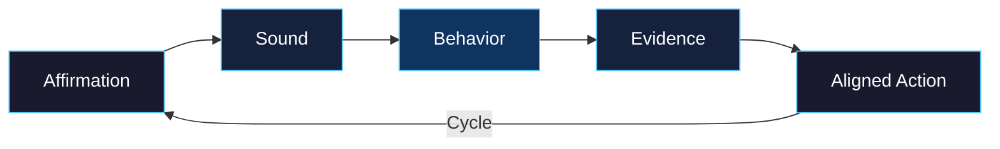

<div align="center">


<br/>


<br/>


<a href="https://deontewattsv1.github.io/Harmonic-Visual-Environment-Journal-and-HIMM/"></a>


</div>

---

## Overview

The **Harmonic Visual Environment Journal** pairs daily observational entries with the **Harmonic Intention Mapping Model (HIMM)** to create a structured, evidence-based practice for personal and environmental alignment.

This is a **30-day open-science field notebook** — a quantitative framework for tracking the relationship between intention, environment, and action through five measurable pillars.

> **Author:** Deonte Watts
> **ORCID:** [0009-0005-8586-3650](https://orcid.org/0009-0005-8586-3650)

---

## Framework Pillars

| Pillar | Icon | Description |
|---|:---:|---|
| **Affirmation** | :speech_balloon: | Intentional statements of purpose |
| **Sound** | :musical_note: | Auditory environment mapping |
| **Behavior** | :footprints: | Observable daily action tracking |
| **Evidence** | :bar_chart: | Data-driven reflection and empirical verification |
| **Aligned Action** | :dart: | Goal-congruent next steps based on pillar data |

---

## HIMM Framework Flow



Each day, you move through the five pillars in sequence. At the end of a cycle, data from **Evidence** informs your next **Affirmation**, creating a feedback loop for continuous alignment.

---

## Journal Download

<div align="center">

<a href="assets/journal.pdf"></a>

</div>

The 30-day field notebook provides structured daily entry templates for recording observations across all five pillars.

---

## Getting Started

### How to Use the Journal

1. **Download** the [30-Day Field Notebook PDF](assets/journal.pdf)
2. **Set your affirmation** for Day 1 — a clear intentional statement
3. **Map your sound environment** — what do you hear? Document it
4. **Track behavior** — what observable actions did you take?
5. **Record evidence** — quantitative reflection on results
6. **Define aligned action** — one goal-congruent step for tomorrow
7. **Repeat** through all 30 days, building a longitudinal dataset

### How to Use the Web Interface

1. Visit the [live site](https://deontewattsv1.github.io/Harmonic-Visual-Environment-Journal-and-HIMM/)
2. Explore the framework overview and pillar descriptions
3. Use alongside the PDF journal for a combined digital + analog practice

---

<details>
<summary><strong>Repository Structure</strong></summary>

<br/>

```text
Harmonic-Visual-Environment-Journal-and-HIMM/
├── index.html              # Primary web entrypoint and framework overview
├── assets/
│   ├── journal.pdf         # Core 30-day field notebook artifact
│   └── styles.css          # Central layout and visual definitions
├── content/                # Source Markdown files for journal sections
├── _config.yml             # Jekyll configuration and system metadata
├── .github/
│   └── workflows/          # CI/CD pipelines for validation and deployment
├── LICENSE                 # CC0-1.0 legal waiver for open-science data
└── README.md               # You are here
```

</details>

---

## GitHub Pages

The site is deployed via GitHub Pages and accessible at:

<div align="center">

<a href="https://deontewattsv1.github.io/Harmonic-Visual-Environment-Journal-and-HIMM/"></a>

</div>

---

## Quick Stats

<div align="center">


</div>

---

## Related Projects

<div align="center">

<a href="https://github.com/DeontewattsV1/Git-Locker-"></a>
<a href="https://github.com/DeontewattsV1/The-Architects-Signal"></a>
<a href="https://github.com/DeontewattsV1/Wildfire-The-Architecture-of-Surrender"></a>

</div>

---

<details>
<summary><strong>Support This Project</strong></summary>

<br/>

<div align="center">

[](https://www.patreon.com/cw/GetitD)
[](https://opencollective.com/deontewattsv1)
[](https://ko-fi.com/deontewattsv1)
[](https://sonarcloud.io/organizations/deontewattsv1/)
[](https://crowdfunding.lfx.linuxfoundation.org/deontewattssV1)
[](https://liberapay.com/DeontewattsV1/)
[](https://issuehunt.io/profiles/deontewattsv1)
[](https://polar.sh/dashboard/deonte-watts)
[](https://buymeacoffee.com/deontewattsv1)
[](https://thanks.dev/e/gh/deontewattsv1)

</div>

</details>

---

<div align="center">

> **Author:** Deonte Watts
> **ORCID:** [0009-0005-8586-3650](https://orcid.org/0009-0005-8586-3650)

<br/>


<br/>


<strong>Harmonic Visual Environment Journal & HIMM</strong><br/>
Open Science · Quantitative Alignment · Evidence-Based Practice

</div>
